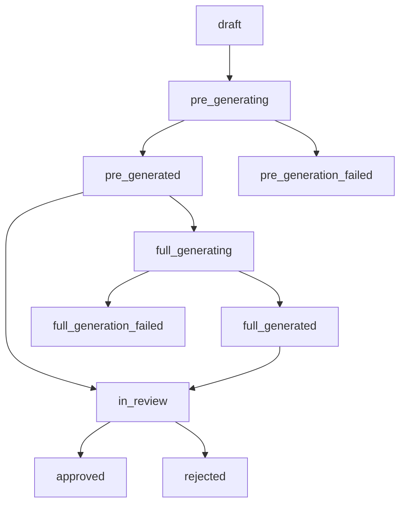

# GPTPult - Система генерации документов

Автоматизированная система генерации документов с использованием GPT и Laravel 11 + Inertia.js + Vue.js + Quasar.

## 🚀 Архитектура генерации

Система поддерживает **двухэтапную генерацию документов**:

1. **Базовая генерация** - создание структуры и целей документа (быстро, 3-5 сек)
2. **Полная генерация** - детальное содержимое с примерами и объяснениями (30-60 сек)

## 📊 Статусы документов

### Жизненный цикл документа



### Описание статусов

| Статус | Описание | Цвет | Иконка | Финальный |
|--------|----------|------|--------|-----------|
| `draft` | Черновик (создан, не запущена генерация) | grey | edit | ❌ |
| `pre_generating` | Генерируется структура и ссылки | primary | sync | ❌ |
| `pre_generated` | Базовая структура готова | positive | check_circle | ❌ |
| `pre_generation_failed` | Ошибка генерации структуры | negative | error | ✅ |
| `full_generating` | Генерируется полное содержимое | secondary | autorenew | ❌ |
| `full_generated` | Документ полностью готов | green | task_alt | ❌ |
| `full_generation_failed` | Ошибка полной генерации | red | error_outline | ✅ |
| `in_review` | На проверке | warning | rate_review | ❌ |
| `approved` | Утвержден | green-10 | verified | ✅ |
| `rejected` | Отклонен | red-8 | cancel | ✅ |

## 🛠 Команды для тестирования

### Демонстрация системы

```bash
# Полная демонстрация новой системы генерации
php artisan demo:full-system --user-id=1 --topic="Планирование IT-проекта"
```

### Управление очередями

```bash
# Запуск воркера очереди документов
php artisan queue:work-documents

# Запуск воркера с кастомным таймаутом
php artisan queue:work-documents --timeout=600
```

### Тестирование генерации

```bash
# Тестирование базовой генерации
php artisan test:document-generation --topic="Тема документа"

# Тестирование полной генерации документа
php artisan test:full-generation {document_id}

# Демонстрация полного цикла статусов
php artisan test:status-flow --user-id=1
```

### Управление документами

```bash
# Утверждение документа
php artisan document:approve {document_id}

# Проверка статуса через CLI
php artisan tinker
>>> App\Models\Document::find(1)->status
```

## 📡 API Endpoints

### Основные операции с документами

#### Получение статуса документа
```http
GET /documents/{document}/status
```

**Ответ:**
```json
{
    "document_id": 1,
    "status": "pre_generated",
    "status_label": "Структура готова",
    "status_color": "positive",
    "status_icon": "check_circle",
    "is_final": false,
    "is_generating": false,
    "can_start_full_generation": true,
    "is_fully_generated": false,
    "title": "Название документа",
    "updated_at": "2024-01-20T10:30:00.000000Z",
    "has_contents": true,
    "has_objectives": true,
    "has_detailed_contents": false,
    "has_introduction": false,
    "has_conclusion": false,
    "structure_complete": true
}
```

#### Быстрое создание документа
```http
POST /documents
Content-Type: application/json

{
    "document_type_id": 1,
    "topic": "Тема документа"
}
```

### Полная генерация

#### Запуск полной генерации
```http
POST /documents/{document}/generate-full
```

**Ответ при успехе:**
```json
{
    "message": "Полная генерация документа запущена",
    "document_id": 1,
    "status": "full_generating"
}
```

**Ответ при ошибке (статус 422):**
```json
{
    "message": "Документ не готов к полной генерации",
    "current_status": "draft",
    "required_status": "pre_generated"
}
```

#### Получение прогресса генерации
```http
GET /documents/{document}/generation-progress
```

**Ответ:**
```json
{
    "document_id": 1,
    "status": "full_generating",
    "status_label": "Генерируется содержимое...",
    "is_generating": true,
    "can_start_full_generation": false,
    "is_fully_generated": false,
    "progress": {
        "has_basic_structure": true,
        "has_detailed_contents": false,
        "has_introduction": false,
        "has_conclusion": false,
        "completion_percentage": 40
    }
}
```

### Дополнительные операции

#### Скачивание Word-документа
```http
POST /documents/{document}/download-word
```

#### Просмотр документа
```http
GET /documents/{document}
```

#### Редактирование документа
```http
GET /documents/{document}/edit
PUT /documents/{document}
```

## 🎯 Frontend интеграция

### Композабл для отслеживания статусов

```javascript
import { useDocumentStatus } from '@/composables/documentStatus'

const {
    status,
    isGenerating,
    canStartFullGeneration,
    isFullGenerationComplete,
    getStatusText,
    startPolling,
    stopPolling
} = useDocumentStatus(
    () => documentId,
    {
        autoStart: true,
        onComplete: (status) => console.log('Базовая генерация завершена'),
        onFullComplete: (status) => console.log('Полная генерация завершена'),
        onApproved: (status) => router.visit(`/documents/${documentId}`),
        onError: (err) => console.error('Ошибка:', err.message)
    }
)
```

### Методы композабла

| Метод | Описание |
|-------|----------|
| `isPreGenerationComplete()` | Завершена ли базовая генерация |
| `isFullGenerationComplete()` | Завершена ли полная генерация |
| `canStartFullGeneration()` | Можно ли запустить полную генерацию |
| `isGenerating()` | Идет ли процесс генерации |
| `hasFailed()` | Произошла ли ошибка |
| `isApproved()` | Утвержден ли документ |
| `isFinal()` | Финальный ли статус |
| `getStatusText()` | Человекочитаемое название статуса |

## 📈 Структура данных документа

### Базовая структура (после pre_generated)
```json
{
    "topic": "Тема документа",
    "contents": [
        {
            "title": "Раздел 1",
            "subtopics": [
                {"title": "Подраздел 1.1"}
            ]
        }
    ],
    "objectives": [
        "Цель 1",
        "Цель 2"
    ]
}
```

### Полная структура (после full_generated)
```json
{
    "topic": "Тема документа",
    "contents": [...],
    "objectives": [...],
    "introduction": "Подробное введение к документу (минимум 500 слов)",
    "conclusion": "Заключение документа (минимум 400 слов)",
    "detailed_objectives": [
        {
            "title": "Название цели",
            "description": "Подробное описание",
            "success_criteria": "Критерии успеха"
        }
    ],
    "detailed_contents": [
        {
            "title": "Раздел 1",
            "introduction": "Введение к разделу",
            "subtopics": [
                {
                    "title": "Подраздел 1.1",
                    "content": "Детальное содержание (минимум 300 слов)",
                    "examples": ["Пример 1", "Пример 2"],
                    "key_points": ["Ключевой момент 1", "Ключевой момент 2"]
                }
            ],
            "summary": "Краткое резюме раздела"
        }
    ]
}
```

## ⚙️ Конфигурация

### Настройки очереди (config/queue.php)
```php
'connections' => [
    'database' => [
        'queues' => [
            'document_creates' => ['timeout' => 300], // 5 минут для генерации
        ],
    ],
],
```

### Настройки GPT по умолчанию
```php
// В DocumentFactory
'gpt_settings' => [
    'service' => 'openai',
    'model' => 'gpt-3.5-turbo', // Базовая генерация
    'temperature' => 0.7,
],

// В StartFullGenerateDocument
'model' => 'gpt-4', // Полная генерация (более мощная модель)
'temperature' => 0.8,
```

## 🔍 Логирование

Все операции генерации логируются в `storage/logs/queue.log`:

```bash
# Просмотр логов в реальном времени
tail -f storage/logs/queue.log

# Поиск ошибок
grep "ERROR" storage/logs/queue.log

# Поиск по документу
grep "document_id.*123" storage/logs/queue.log
```

## 🧪 Пример полного цикла

```bash
# 1. Демонстрация системы
php artisan demo:full-system --topic="Внедрение CRM системы"

# 2. Запуск воркера (в отдельном терминале)
php artisan queue:work-documents

# 3. Проверка статуса через API
curl -X GET http://localhost/documents/1/status

# 4. Запуск полной генерации (после pre_generated)
php artisan test:full-generation 1

# 5. Утверждение документа
php artisan document:approve 1
```

## 📱 UI компоненты

### Кнопка полной генерации
Появляется автоматически в компоненте `ShowDocument.vue` при статусе `pre_generated`:

```vue
<q-btn
    v-if="canStartFullGeneration()"
    label="Полная генерация"
    color="secondary"
    icon="autorenew"
    :loading="isStartingFullGeneration"
    @click="startFullGeneration"
/>
```

### Прогресс-бар завершенности
```vue
<q-linear-progress 
    :value="documentStatus.progress.completion_percentage / 100"
    color="positive"
    size="8px"
/>
```

## 🔧 Troubleshooting

### Проблемы с очередями
```bash
# Очистка неудачных задач
php artisan queue:flush

# Перезапуск задач
php artisan queue:retry all

# Проверка воркеров
php artisan queue:monitor
```

### Проблемы с генерацией
```bash
# Проверка настроек GPT
php artisan tinker
>>> App\Models\Document::find(1)->gpt_settings

# Тестирование конкретного сервиса
>>> App\Services\Gpt\GptServiceFactory::make('openai')
```

### Отладка статусов
```bash
# Ручное изменение статуса
php artisan tinker
>>> $doc = App\Models\Document::find(1)
>>> $doc->status = App\Enums\DocumentStatus::PRE_GENERATED
>>> $doc->save()
```

## 📋 TODO / Планы развития

- [ ] Поддержка пакетной генерации документов
- [ ] Интеграция с Anthropic Claude
- [ ] Кэширование результатов генерации
- [ ] Webhook уведомления о завершении
- [ ] Экспорт в другие форматы (PDF, HTML)
- [ ] Система шаблонов документов
- [ ] Collaborative editing
- [ ] Версионирование документов

## 📚 Дополнительная документация

- **[API Reference](docs/API_REFERENCE.md)** - Подробное описание всех API endpoints
- **[Справочник команд](docs/COMMANDS.md)** - Полный список команд для тестирования и разработки
- **[Справочник статусов](docs/STATUS_REFERENCE.md)** - Детальное описание всех статусов документов

## 🚀 Быстрый старт

1. **Демонстрация системы:**
   ```bash
   php artisan demo:full-system --topic="Мой проект"
   ```

2. **Запуск воркера очередей:**
   ```bash
   php artisan queue:work-documents
   ```

3. **Проверка статуса через API:**
   ```bash
   curl -X GET "http://localhost/documents/1/status"
   ```

## 🆘 Поддержка

При возникновении проблем:
1. Проверьте логи: `tail -f storage/logs/queue.log`
2. Убедитесь, что воркер очередей запущен
3. Проверьте статус документа через API
4. Обратитесь к [справочнику команд](docs/COMMANDS.md) для отладки
